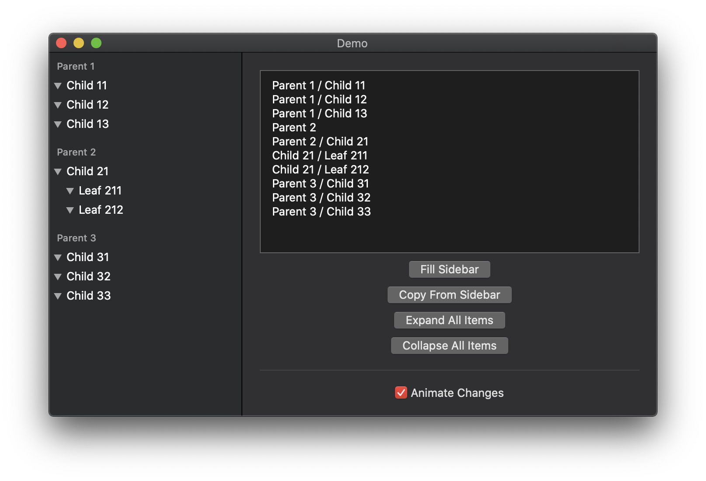

> Here’s to the crazy ones…

## Introduction

At WWDC 2019 Apple introduced amazing APIs for `UITableView` and `UICollectionView`  data management. For instance, the barely documented [`UITableViewDiffableDataSource`](https://developer.apple.com/documentation/uikit/uitableviewdiffabledatasource) can be used as a data source of a table view, and all modifications made to its [`NSDiffableDataSourceSnapshot`](https://developer.apple.com/documentation/uikit/nsdiffabledatasourcesnapshot) are automatically applied by that table view.

### Watch the official video [“Advances in UI Data Sources”](https://developer.apple.com/videos/play/wwdc2019/220/) to get a better idea.

These diffable APIs were fantastic news for UIKit Developers. Unfortunately AppKit has got only [`NSCollectionViewDiffableDataSource`](https://developer.apple.com/documentation/appkit/nscollectionviewdiffabledatasource) and [`NSTableViewDiffableDataSource`](https://developer.apple.com/documentation/appkit/nstableviewdiffabledatasourcereference) which means that `NSOutlineView` is out of luck. Let’s hope that Apple releases `NSOutlineViewDiffableDataSource` at WWDC21.

## OutlineViewDiffableDataSource

This Swift Package is my modest attempt to implement a diffable data source for `NSOutlineView` with support for nested items. This is how it’s used:

```swift
let dataSource = OutlineViewDiffableDataSource (outlineView: outlineView)
var snapshot = dataSource.snapshot()
snapshot.appendItems([folder1, folder2])
snapshot.appendItems([file11, file12], into: folder1)
snapshot.appendItems([file21, file22], into: folder2)
dataSource.applySnapshot(initialSnapshot, animatingDifferences: false)
```

The accompanying `DiffableDataSourceSnapshot` API is heavily inspired by Cocoa’s own `NSDiffableDataSourceSnapshot` and includes many similar methods, but adopted for tree data structures:

```swift
// …
mutating func insertItems(_ newItems: [Item], beforeItem: Item) -> Bool
mutating func insertItems(_ newItems: [Item], afterItem: Item) -> Bool
mutating func deleteItems(_ existingItems: [Item]) -> Bool
mutating func deleteAllItems()
mutating func reloadItems(_ items: [Item]) -> Bool
// …
```

Not sure how this ends, but the `DiffableDataSourceSnapshot` is a value type. Just like its “official” counterpart, this struct can be built and applied from the background thread, as far as I know 😅 

## Demo App

The Demo Mac app is a playground for breaking the library. The snapshot API is 100% covered by Tests, but I would much appreciate any help with QA.



## Help Wanted

If you download and play with the sample app, it’s already cool. But if you report or even fix one of the issues, you are just awesome. Here is a Roadmap, please join me if you can:

- [ ] Add a new section “Quick Start”
- [ ] Explain the protocol `OutlineViewItem`
- [ ] Explain how to implement drag-n-drop in your app
- [ ] Add versioning because now it’s just a `master` branch
- [ ] Add this project to the [Dave’s](https://swiftpm.co) repository  of Swift Packages
- [ ] Improve the Demo app, it’s too basic and doesn’t show all the features
- [ ] File a Radar requesting a real `NSOutlineViewDiffableDataSource`, why not
- [ ] Make a profile picture from one of WWDC slides about diffable data sources
- [ ] Generate documentation using [Swift Doc](https://github.com/marketplace/actions/swift-doc)
- [ ] Add badges like “Swift 5.2” and “CI Passing”
- [ ] Fill the [Community Profile](https://github.com/shpakovski/OutlineViewDiffableDataSource/community)
- [ ] Add Showcase section if anyone uses this component

## Contact Information

You can always find me as [@VadimShpakovski](https://twitter.com/VadimShpakovski) in Twitter. If you publish apps in the App Store or in the Mac App Store, check out my native client for the App Store Connect: [NativeConnect](https://twitter.com/NativeConnect). Some people like it. Thanks in advance!
